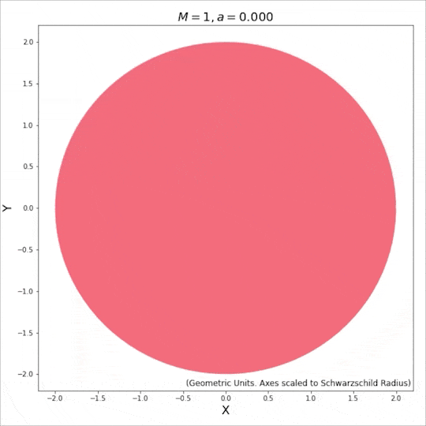

Examples
========

Here, we have listed some Jupyter notebooks that exemplify the usage of various features offered by EinsteinPy. 
We have broadly divided them into two categories: `Symbolic` and `Numerical` computations. To run these notebooks 
on the web, please use the binder link provided below.

.. |mybinder| image:: https://img.shields.io/badge/launch-binder-e66581.svg?style=flat-square
   :target: https://mybinder.org/v2/gh/einsteinpy/einsteinpy/main?filepath=docs/source/examples/index.ipynb

|mybinder|

Symbolic computations
---------------------

.. toctree::
   :maxdepth: 1

   /examples/Einstein Tensor symbolic calculation.ipynb
   /examples/Lambdify symbolic calculation.ipynb
   /examples/Playing with Contravariant and Covariant Indices in Tensors (Symbolic).ipynb
   /examples/Predefined Metrics in Symbolic Module.ipynb
   /examples/Ricci Tensor and Scalar Curvature symbolic calculation.ipynb
   /examples/Symbolically Understanding Christoffel Symbol and Riemann Curvature Tensor using EinsteinPy.ipynb
   /examples/Weyl Tensor symbolic calculation.ipynb

These notebooks demonstrate the features of the symbolic module in EinsteinPy. 
You can use this module to access several pre-defined metrics or define custom ones, 
and calculate quantities such as the Christoffel symbols, Ricci tensor, Ricci scalar, 
Riemann curvature tensor, Einstein tensor and Weyl tensor. Since this module is based on 
SymPy, you can also use the ``lambdify()`` function to convert EinsteinPy's symbolic 
expressions into NumPy-compatible functions. Indicial operations are also possible using this 
module, as shown in the notebook on contravariant and covariant indices.

Numerical computations
----------------------

.. toctree::
   :maxdepth: 1

   /examples/Animations in EinsteinPy.ipynb
   /examples/Plotting Spatial Hypersurface Embedding for Schwarzschild Spacetime.ipynb
   /examples/Shadow cast by a thin emission disk around a Schwarzschild black hole.ipynb
   /examples/Using Geodesics (Back-ends & Plotting).ipynb
   /examples/Visualizing Event Horizon and Ergosphere (Singularities) of Kerr Metric or Black Hole.ipynb
   /examples/Visualizing Frame Dragging in Kerr Spacetime.ipynb
   /examples/Visualizing Precession in Schwarzschild Spacetime.ipynb

These notebooks show how to use the various numerical methods offered by EinsteinPy. 
Using these, you can compute and plot geodesics for manifolds described by (electro-)vacuum 
solutions to Einstein's field equations. You can also calculate and view manifold singularities 
in these cases or calculate black hole shadows and hypersurface embeddings for certain spacetimes. 
EinsteinPy's plotting module also enables making animations like these:

.. image:: ./_static/anim.gif
   :alt: Geodesic Animation in extremal Kerr Spacetime
   :width: 540px
   :align: center

.. toctree::
   :hidden:

   /examples/index.ipynb
