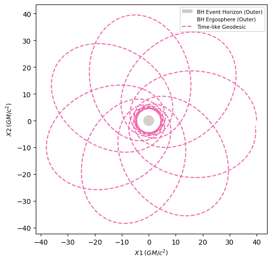

Introduction
============

This page gives a brief overview of some of the features of EinsteinPy. For more complete hands-on tutorials, please refer to the Jupyter notebooks in `Examples`_.

.. _Examples: https://docs.einsteinpy.org/en/latest/jupyter.html

:py:class:`~einsteinpy.metric` Module
*************************************

EinsteinPy provides a way to define the background geometry for relativistic dynamics. This geometry has a central operating quantity known as the Metric tensor, that encapsulates all the geometrical and topological information about the 4D spacetime.

* EinsteinPy provides a :py:class:`~einsteinpy.metric.BaseMetric` class, that has various utility functions and a proper template, that can be used to define custom Metric classes. All predefined classes in :py:class:`~einsteinpy.metric` derive from this class.
* The central quantities required to simulate the trajectory of a particle in a gravitational field are the metric derivatives, that can be succinctly written using Christoffel Symbols. EinsteinPy provides an easy-to-use interface to calculate these symbols for the predefined metrics. To perform calculations for general metrics, see the :py:class:`~einsteinpy.symbolic` module.
* :py:class:`~einsteinpy.metric.BaseMetric` also provides support for ``f_vec`` and ``perturbation``, where ``f_vec`` corresponds to the RHS of the geodesic equation and ``perturbation`` is a linear Kerr-Schild Perturbation that can be defined on the underlying metric. Note that EinsteinPy does not perform physical checks on ``perturbation`` currently. Users should exercise caution while using it.

----

:py:class:`~einsteinpy.geodesic` Module
***************************************
EinsteinPy provides an intuitive interface for calculating timelike and nulllike geodesics for vacuum solutions. Below, we calculate the orbit of a precessing particle in Schwarzschild spacetime.

First, we import all the relevant modules and classes and define the initial conditions for our test particle, such as its initial 3-position in spherical coordinates and corresponding 3-momentum (or 3-velocity, given that we are working in geometric units with :math:`M = 1`).

    .. code-block:: python

        import numpy as np
        from einsteinpy.geodesic import Timelike
        from einsteinpy.plotting.geodesic import StaticGeodesicPlotter

        position = [40., np.pi / 2, 0.]
        momentum = [0., 0., 3.83405]
        a = 0. # Spin = 0 for a Schwarzschild black hole
        steps = 5500 # Number of steps to be taken by the solver
        delta = 1 # Step size

After defining our initial conditions, we can use :py:class:`~einsteinpy.geodesic.Timelike` to create a Geodesic object, that automatically calculates the trajectory. 

    .. code-block:: python

        geod = Timelike(
            metric="Schwarzschild",
            metric_params=(a,),
            position=position,
            momentum=momentum,
            steps=steps,
            delta=delta,
            suppress_warnings=True,
            return_cartesian=True
        )
        print(geod)

    .. code-block:: python

        Geodesic Object:(
            Type : (Time-like),
            Metric : (Schwarzschild),
            Metric Parameters : ((0.0,)),
            Initial 4-Position : ([ 0.         40.          1.57079633  0.        ]),
            Initial 4-Momentum : ([-0.97914661  0.          0.          3.83405   ]),
            Trajectory = (
                (array([  0,   1,   2,   3,   4,   5,   6,   7,   8,   9,  10,  11,  12,
                        13,  14,  15,  16,  17,  18,  19,  20,  21,  22,  23,  24,  25,
                        26,  27,  28,  29,  30,  31,  32,  33,  34,  35,  36,  37,  38,
                        ...
                        468, 469, 470, 471, 472, 473, 474, 475, 476, 477, 478, 479, 480,
                        481, 482, 483, 484, 485, 486, 487, 488, 489, 490, 491, 492, 493,
                        494, 495, 496, 497, 498, 499]),
                array([[ 1.03068069e+00,  3.99997742e+01,  9.58510673e-02, ...,
                        -3.87363444e-04,  5.62571365e-19,  3.83405000e+00],
                        [ 2.06136190e+00,  3.99987445e+01,  1.91699898e-01, ...,
                        -9.48048366e-04,  1.12515772e-18,  3.83404999e+00],
                        ...,
                        [ 5.71172446e+02,  1.55983863e+01,  1.49940531e+01, ...,
                        1.65861080e-01,  3.12992232e-15,  3.83405010e+00],
                        [ 5.72250940e+02,  1.55832138e+01,  1.52252617e+01, ...,
                        1.64780132e-01,  3.13183198e-15,  3.83404993e+00]]))
            ),
            Output Position Coordinate System = (Cartesian)
        ))

We can also obtain a static plot of the geodesic using :py:class:`~einsteinpy.plotting.geodesic.StaticGeodesicPlotter`.

    .. code-block:: python

        # Use InteractiveGeodesicPlotter() to get interactive plots
        sgpl = StaticGeodesicPlotter()
        sgpl.plot2D(geod)
        sgpl.show()

----

:py:class:`~einsteinpy.coordinates` Module
******************************************
EinsteinPy currently supports 3 coordinate systems, namely, Cartesian, Spherical and Boyer-Lindquist. The :py:class:`~einsteinpy.coordinates` module provides a way to convert between these coordinate systems. Below, we show how to convert 4-positions and velocities (defined alongside positions) between Cartesian and Boyer-Lindquist coordinates.

    .. code-block:: python

        import numpy as np
        from astropy import units as u
        from einsteinpy.coordinates import BoyerLindquistDifferential, CartesianDifferential, Cartesian, BoyerLindquist

        M = 1e20 * u.kg
        a = 0.5 * u.one

        # 4-Position
        t = 1. * u.s
        x = 0.2 * u.km
        y = 0.15 * u.km
        z = 0. * u.km

        _4pos_cart = Cartesian(t, x, y, z)

        # The keyword arguments, M & a are required for conversion to & from Boyer-Lindquist coordinates
        _4pos_bl = _4pos_cart.to_bl(M=M, a=a)
        print(_4pos_bl)

        cartsn_pos = _4pos_bl.to_cartesian(M=M, a=a)
        print(cartsn_pos)

        # With position & velocity
        v_x = 150 * u.km / u.s
        v_y = 250 * u.km / u.s
        v_z = 0. * u.km / u.s

        pos_vel_cart = CartesianDifferential(t, x, y, z, v_x, v_y, v_z)

        # Converting to Boyer-Lindquist coordinates
        pos_vel_bl = pos_vel_cart.bl_differential(M=M, a=a)
        print(pos_vel_bl)

        # Converting back to Cartesian coordinates
        pos_vel_cart = pos_vel_bl.cartesian_differential(M=M, a=a)
        print(pos_vel_cart)

    .. code-block:: python

        Boyer-Lindquist Coordinates: 
            t = (1.0 s), r = (250.0 m), theta = (1.5707963267948966 rad), phi = (0.6435011087932844 rad)
        Cartesian Coordinates: 
            t = (1.0 s), x = (200.0 m), y = (150.0 m), z = (1.5308084989341916e-14 m)
        Boyer-Lindquist Coordinates: 
            t = (1.0 s), r = (250.0 m), theta = (1.5707963267948966 rad), phi = (0.6435011087932844 rad)
            v_t: None, v_r: 270000.0 m / s, v_th: -0.0 rad / s, v_p: 440.0 rad / s
        Cartesian Coordinates: 
            t = (1.0 s), x = (200.0 m), y = (150.0 m), z = (1.5308084989341916e-14 m)
            v_t: None, v_x: 150000.0 m / s, v_y: 250000.0 m / s, v_z: 1.6532731788489268e-11 m / s

You can also pass a ``einsteinpy.metric.*`` object to the differential object to set ``v_t``. For usage without units, see the functions in ``einsteinpy.coordinates.util``.

----

:py:class:`~einsteinpy.symbolic` Module
***************************************
EinsteinPy also supports a robust symbolic module that allows users to access several predefined metrics, or to define custom metrics and perform symbolic calculations. A short example with a predefined metric is shown below.

    .. code-block:: python

        from sympy import simplify
        from einsteinpy.symbolic import Schwarzschild, ChristoffelSymbols, EinsteinTensor

        m = Schwarzschild()
        ch = ChristoffelSymbols.from_metric(m)
        G1 = EinsteinTensor.from_metric(m)
        print(f"ch(1, 2, k) = {simplify(ch[1, 2, :])}") # k is an index in [0, 1, 2, 3]
        print(G1.arr)

    .. code-block:: python

        ch(1, 2, k) = [0, 0, -r + r_s, 0]
        [[0, 0, 0, 0], [0, 0, 0, 0], [0, 0, 0, 0], [0, 0, 0, 0]]

----

Utility functions
*****************
EinsteinPy provides a great set of utility functions in many of the modules which are frequently used in general and numerical relativity.

* Utils in :py:class:`~einsteinpy.coordinates`, that allow:
    * Unitless conversion between coordinate systems for both position & velocity in the following systems:
        * Cartesian
        * Spherical
        * Boyer-Lindquist
    * Calculation of Lorentz factor
    * Calculation of timelike component of 4-velocity in any pseudo-Riemannian metric
* Utils in :py:class:`~einsteinpy.geodesic` that can be used to calculate quantities related to the vacuum solutions, such as:
    * :math:`\rho^2 = r^2 + a^2\cos^2(\theta)` or :math:`\Delta = r^2 - r_s r + a^2 + r_Q^2`
    * Calculation of particle 4-momentum

----

Future Plans
************
* Support for null-geodesics in different geometries
    * Partial support is available for vacuum solutions since version 0.4.0.
* Ultimate goal is to provide numerical solutions for Einstein's equations for arbitrarily complex matter distributions.
* Relativistic hydrodynamics
